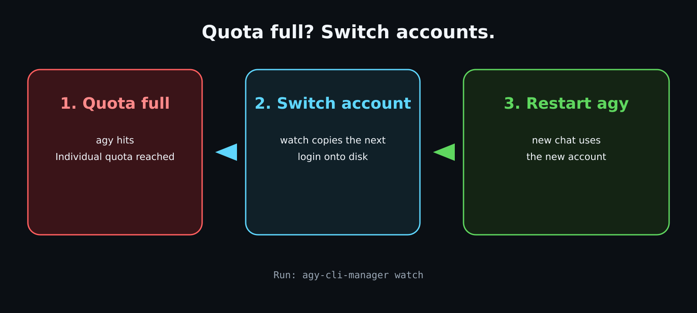

# agy-cli-manager

[English](README.md) | [中文](README.zh-CN.md)

`agy-cli-manager` is a Python account manager for Antigravity CLI (`agy`) with active-standby failover, quota-aware switching, and machine-readable automation APIs.

It helps you run multiple Antigravity CLI accounts more safely by:

- switching away from low-quota or failed accounts
- watching live Antigravity CLI logs for `Individual quota reached` and failing over automatically
- keeping a managed runtime profile in sync with the active account
- exposing CLI and Python APIs for bots, schedulers, and external apps
- supporting manual or automatic account rotation policies

Keywords:
Antigravity CLI account manager, Antigravity CLI multi account manager, Antigravity multi account auth, Antigravity login manager, Antigravity auth manager, Antigravity account switcher, agy multi account manager, agy multi account auth, agy login manager, agy auth manager, agy failover, agy quota switching, Gemini CLI multi account auth, Gemini CLI account rotation.

It is designed for one active account at a time:

- keep multiple saved `agy` profiles
- switch the active profile explicitly or after failure
- expose machine-readable state for external callers
- stay usable as a CLI app, TUI dashboard, or Python library

It is application-agnostic. A Telegram bot can call it, but the manager itself is not Telegram-specific.


This is a fork of [zcop/agy-cli-manager](https://github.com/zcop/agy-cli-manager)
adding support for `agy` builds that store their credential in the OS keyring
instead of a token file -- see [Credential storage](#credential-storage).

Project links:

- This fork: `https://github.com/KaylaONeal/agy-cli-manager`
- Upstream repo: `https://github.com/zcop/agy-cli-manager`
- Release wheel (upstream): `https://github.com/zcop/agy-cli-manager/releases`
- GitHub Pages site (upstream): `https://zcop.github.io/agy-cli-manager/`

Released wheels come from upstream and do not yet contain the keyring support
in this fork; install from source to get it.

## What it does

- stores multiple account profiles safely
- keeps one account active while others stay standby/cooldown/disabled
- supports isolated interactive `agy` login
- can import an existing `~/.gemini` or similar live home
- works with both token-file and OS-keyring `agy` builds (Linux Secret Service, macOS Keychain)
- supports both manual-only and automatic failover switching modes
- prefers fuller, healthier standby accounts when auto-switching
- tracks cached identity, health, and usage metadata
- tracks live switch coordinator state for callers that need to wait on failover
- exposes CLI commands and JSON output for automation
- supports account failover with cooldowns and lock-protected state changes
- tails Antigravity CLI logs so a running `agy` TUI can trigger failover without a bot caller

## Requirements

- Python 3.10+
- a working `agy` binary available in `PATH`, or passed explicitly with `--agy-binary`
- a terminal if you want to use `login` or the full-screen dashboard
- on Linux, `secret-tool` (package `libsecret`) if your `agy` build stores its
  credential in the OS keyring -- see below

## Credential storage

Older `agy` builds kept the OAuth credential in a file
(`~/.gemini/antigravity-cli/antigravity-oauth-token`). Newer builds store it in
the native OS credential store instead:

| Platform | Store | Slot |
| --- | --- | --- |
| Linux | Secret Service (D-Bus) | `service=gemini`, `username=antigravity` |
| macOS | Keychain | `service=gemini`, `account=antigravity` |

The stored value is the same JSON document the token file used to hold, so the
manager keeps using the token file as its on-disk profile format and bridges at
two points: it captures the credential out of the keyring when you save an
account, and publishes it back into the keyring when you switch.

Nothing about the layout changes -- profiles still live under
`~/.agy-cli-manager/accounts/<name>/`. Before switching away, the manager
snapshots the live credential back into the outgoing account, because `agy`
refreshes the token in place while it runs; without that, switching back would
restore a stale refresh token.

`status` reports the detected backend:

```
credential_store: secret-service (gemini/antigravity)
```

If it reports `none` on Linux, install libsecret:

```bash
sudo pacman -S libsecret        # Arch / Omarchy
sudo apt install secret-tools   # Debian / Ubuntu
```

A daemonised `watch` needs a reachable session bus; the manager falls back to
`/run/user/$UID/bus` when `DBUS_SESSION_BUS_ADDRESS` is unset.

Environment overrides: `AGY_CREDENTIAL_BACKEND`
(`auto` | `secret-service` | `keychain` | `none`), `AGY_KEYRING_SERVICE`,
`AGY_KEYRING_USERNAME`.

**Restarting `agy` is required after a switch** -- a running process has the
credential cached in memory.

## Platform support

| Platform | Credential store | Status |
| --- | --- | --- |
| Linux (X11/Wayland desktop) | Secret Service via `secret-tool` | Supported, tested |
| macOS | Keychain via `security` | Implemented, not covered by CI |
| Linux (headless/container) | none -- token file only | Works if your `agy` build still writes the token file |
| Windows | none -- token file only | File locking works; Credential Manager is not implemented |

Everything other than the credential store is platform-independent: profile
storage, switching, cooldowns, log watching, and the JSON APIs behave the same
everywhere. CI runs on Linux only.

On a platform with no credential-store backend the manager falls back to
token-file profiles, which is exactly how it behaved before keyring support
existed. That is fine for older `agy` builds; if your `agy` stores its
credential in the OS keyring and the manager reports
`credential_store: none`, saving and switching accounts will not work until a
backend is available.

## Install

One line, with [pipx](https://pipx.pypa.io) (recommended -- isolated, and puts
`agy-cli-manager` on your PATH):

```bash
pipx install git+https://github.com/KaylaONeal/agy-cli-manager.git
```

No pipx? A venv works just as well:

```bash
python3 -m venv ~/.venvs/agy-cli-manager
~/.venvs/agy-cli-manager/bin/pip install git+https://github.com/KaylaONeal/agy-cli-manager.git
~/.venvs/agy-cli-manager/bin/agy-cli-manager --help
```

On Linux, also install libsecret if your `agy` keeps its credential in the
system keyring (see [Credential storage](#credential-storage)):

```bash
sudo pacman -S libsecret        # Arch / Omarchy
sudo apt install secret-tools   # Debian / Ubuntu
```

Check it worked:

```bash
agy-cli-manager status
```

A `credential_store:` line naming a backend means you are ready to go.

To upgrade later:

```bash
pipx upgrade agy-cli-manager
```

<details>
<summary>Other install methods</summary>

From a local clone, in editable mode (for development):

```bash
git clone https://github.com/KaylaONeal/agy-cli-manager.git
cd agy-cli-manager
python3 -m venv .venv
. .venv/bin/activate
pip install -e .
```

From an upstream release wheel -- note these do **not** yet contain the keyring
support in this fork:

```bash
pip install https://github.com/zcop/agy-cli-manager/releases/download/v0.2.1/agy_cli_manager-0.2.1-py3-none-any.whl
```

Without installing at all:

```bash
PYTHONPATH=src python3 -m agy_cli_manager.cli --help
```

</details>

## Quick Start

### 1. Initialize the manager state

```bash
agy-cli-manager init
```

By default, state lives under:

```text
~/.agy-cli-manager
```

You can override that with `--root /path/to/root`.

### 2. Add your first account

If you already have a live Antigravity home:

```bash
agy-cli-manager import-current my-account ~/.gemini
```

If you want the manager to drive a fresh interactive login itself:

```bash
agy-cli-manager login my-account --agy-binary /path/to/agy
```

`login` will hand your terminal to a real `agy` session. Complete the normal Antigravity onboarding/login there, then exit `agy`. The manager will save the resulting profile snapshot.

### 3. Check what is active

```bash
agy-cli-manager status
agy-cli-manager current
agy-cli-manager list
```

### 4. Open the dashboard

```bash
agy-cli-manager
```

With no subcommand, the full-screen dashboard opens by default.

### 5. Auto-switch when quota is full

When `agy` hits **Individual quota reached**, the manager switches to the next account. Restart `agy` after that. The old process may keep writing quota errors; those lines do not rotate again until you acknowledge the restart or a new session log appears.



```bash
agy-cli-manager switch-mode auto
agy-cli-manager watch
```

After restarting `agy`:

```bash
agy-cli-manager ack-restart
```

Leave the dashboard open instead of `watch` if you prefer (`Y` acknowledges the restart). Do not pass `--from-start` unless you intend to replay old quota errors.

## First Useful Commands

```bash
agy-cli-manager status --json
agy-cli-manager whoami
agy-cli-manager models --json
agy-cli-manager ensure-active --json
agy-cli-manager switch-mode
agy-cli-manager switch-mode manual
agy-cli-manager switch-mode auto
agy-cli-manager switch-policy --json
agy-cli-manager switch-policy --short-threshold 10 --refresh-failure-threshold 2 --candidate-strategy balanced
agy-cli-manager refresh-usage --json
agy-cli-manager switch-next
agy-cli-manager rotate-after-failure --reason quota --cooldown-minutes 60 --json
agy-cli-manager watch
agy-cli-manager watch --once --json
agy-cli-manager ack-restart
```

The current switch policy is stored in manager state and can be controlled by either:

- CLI: `switch-mode`, `switch-policy`, `ensure-active`
- Python API: `get_status_snapshot()`, `get_switch_policy()`, `update_switch_policy()`, `ensure_active_account()`

Directory layout:

```text
~/.agy-cli-manager/
├── accounts/
│   └── <account-name>/
│       └── .gemini/
│           └── ...
├── runtime/
│   └── .gemini/
└── state.json
```

Optional integration:

- `live_dir` can point at a real Antigravity/Gemini CLI home such as `~/.gemini`
- when set, switches sync the managed active profile into that live CLI home

Example:

```bash
agy-cli-manager set-live-dir ~/.gemini
agy-cli-manager apply-active
```

This is useful when another process launches `agy` and you want that live home to always reflect the currently active saved profile.

Commands:

```bash
agy-cli-manager
agy-cli-manager dashboard
agy-cli-manager menu
agy-cli-manager init
agy-cli-manager list
agy-cli-manager current
agy-cli-manager status
agy-cli-manager status --json
agy-cli-manager ensure-active
agy-cli-manager switch-mode
agy-cli-manager switch-mode manual
agy-cli-manager switch-mode auto
agy-cli-manager switch-policy
agy-cli-manager refresh-usage
agy-cli-manager refresh-usage account1 --json
agy-cli-manager refresh-due
agy-cli-manager refresh-due --json
agy-cli-manager models
agy-cli-manager models --json
agy-cli-manager models account1 --json
agy-cli-manager whoami
agy-cli-manager whoami account1 --refresh
agy-cli-manager whoami account1 --probe-usage --agy-binary /path/to/agy
agy-cli-manager add account1 /path/to/source
agy-cli-manager import-current account1
agy-cli-manager import-current account1 /path/to/.gemini
agy-cli-manager login
agy-cli-manager login account1 --agy-binary /path/to/agy
agy-cli-manager activate account1
agy-cli-manager switch account1
agy-cli-manager rotate
agy-cli-manager switch-next
agy-cli-manager disable account1
agy-cli-manager enable account1
agy-cli-manager mark-bad account1 --reason quota --cooldown-minutes 60
agy-cli-manager clear-bad account1
agy-cli-manager set-live-dir ~/.gemini
agy-cli-manager apply-active
agy-cli-manager switch-mode manual
agy-cli-manager rotate-after-failure --reason quota --cooldown-minutes 60 --json
agy-cli-manager rotate-after-failure --reason quota --cooldown-minutes 60 --force-switch --json
agy-cli-manager watch
agy-cli-manager watch --once --json
agy-cli-manager watch --no-rotate --once
agy-cli-manager update-meta account1 --usage-status known --usage-value 42 --reset-at 2026-07-01T00:00:00+00:00 --health-status healthy --last-live-check-at 2026-06-30T06:00:00+00:00 --next-live-check-at 2026-06-30T06:30:00+00:00 --refresh-policy-seconds 1800
agy-cli-manager update-meta account1 --short-usage-status known --short-usage-value 97.57 --short-reset-at 2026-07-01T00:00:00+00:00 --weekly-usage-status unknown
```

`add` accepts either:

- a directory that is already a `.gemini` profile root
- or a parent directory containing `.gemini/`

## JSON/API-oriented usage

For automation, prefer the JSON-capable commands:

```bash
agy-cli-manager status --json
agy-cli-manager current --json
agy-cli-manager list --json
agy-cli-manager ensure-active --json
agy-cli-manager switch-policy --json
agy-cli-manager switch-policy --short-threshold 12.5 --refresh-failure-threshold 3 --candidate-strategy highest-short --json
agy-cli-manager refresh-usage account1 --json
agy-cli-manager refresh-due --json
agy-cli-manager models --json
agy-cli-manager rotate-after-failure --reason quota --cooldown-minutes 60 --json
agy-cli-manager watch --once --json
```

Typical external-app flow:

1. read current state with `status --json`
2. call `ensure-active --json` before sending real work if you want the manager to preflight the active account
3. read `switch_mode` and `switch_policy` to decide how aggressively your caller should auto-fail over
4. use `models --json` if the caller needs model choices for the active account
5. call `refresh-usage --json` or `refresh-due --json` only when needed
6. if a real request fails due to auth/quota, call `rotate-after-failure --json`
7. inspect `switch_runtime` or wait briefly until it leaves `switching`
8. retry the real request once on the new active account
9. persist caller-side observations back with `update-meta`

Notes:

- running `agy-cli-manager` with no subcommand opens the full-screen dashboard
- `dashboard` is a TTY-only full-screen view with a fast local-only UI refresh and manual account actions
- `list`, `current`, `activate`, and `rotate` are convenience commands for standalone use; they map to the same manager state as the lower-level commands.
- local operator notes such as `AGENTS.md` are intentionally kept untracked and are not part of the public repo contract.
- `agy-cli-manager login` prompts for the account name if you do not pass one
- `switch-next` skips accounts in cooldown.
- `mark-bad` clears the active pointer if that account was active.
- `ensure-active` evaluates the current policy and can automatically recover from no active account, known low 5-hour quota, auth missing, or repeated refresh failures.
- `ensure-active` returns JSON with `switch_runtime`, so callers can see whether the manager is idle, switching, ready, or has no standby account available.
- `switch-mode` controls whether `rotate-after-failure` automatically moves to the next eligible standby account or stops after marking the active account bad.
- `switch-policy` controls the proactive short-window threshold, refresh-failure threshold, and standby candidate ranking strategy.
- state and switching are protected by a single lock file so a caller can safely trigger failover from another process.
- `set-live-dir` lets the manager drive a real CLI home in addition to its own internal `runtime/`.
- the manager currently copies the managed profile under `.gemini/`, centered on the Antigravity auth/token artifacts it needs for switching.
- it supports Antigravity-style `antigravity-cli/antigravity-oauth-token` auth storage and related identity extraction.
- `login` hands the terminal directly to a real `agy` session in the configured runtime home; complete onboarding/login there, exit `agy`, and the manager then saves the captured profile snapshot.
- `login` stores the profile under the detected account name when available, not just the typed label.
- if that detected account already exists, `login` warns and asks whether to overwrite the saved profile.
- `whoami` reports the detected signed-in account name from profile metadata, and `--probe-usage` can additionally run `agy -p /usage` against that profile as a live check.
- `models` runs `agy models` for the active account or a named saved profile and can return structured JSON for external callers.
- the manager intentionally does not use scripted PTY startup probing for `agy`; profile switching is filesystem-based. Runtime health still comes from real request success/failure, including Antigravity CLI log lines.
- `watch` tails `live_dir/antigravity-cli/log/` (and `cli.log`) for `RESOURCE_EXHAUSTED (code 429): Individual quota reached` and weekly quota lines. It starts at end-of-file so historical quota errors are not replayed.
- in `auto` mode, `watch` and the dashboard log poll call `rotate-after-failure` with `trigger=log-watch`. In `manual` mode they report the error and leave the active account in place unless `--force-switch` is set.
- a switched profile is on disk (and in the live CLI home) immediately; a running `agy` process must be restarted to pick up the new token.
- in `auto` mode, `ensure-active` and `refresh-usage`/`refresh-due` can proactively switch away from an active account when the cached 5-hour window falls to the configured `short_usage_threshold_percent`, auth is missing, or refresh failures reach the configured threshold.
- cached quota is advisory; real runtime failure is still the final authority for callers such as bots.
- when auto-switching, the manager ranks the standby pool and prefers accounts with better health and more remaining short-window quota instead of simply taking the first account by name.
- the default switch policy is `short_usage_threshold_percent=10`, `refresh_failure_threshold=2`, `candidate_strategy=balanced`.
- `rotate-after-failure` is the public failover operation for external apps: mark the current active account bad, optionally put it in cooldown, then switch to the next eligible standby account.
- `rotate-after-failure` is idempotent across a short dedupe window and reports an `outcome` such as `switched`, `already_switched`, or `no_candidate`.
- `switch_runtime` is persisted in state so a caller can coordinate retry logic without racing another caller into a second switch.
- `rotate-after-failure` follows the persisted switch mode by default: `auto` attempts failover, `manual` leaves the manager inactive until an operator or caller explicitly switches accounts. Use `--force-switch` to override that for one run.
- `update-meta` lets an external app persist cached runtime metadata such as usage, reset time, health, last check, and next refresh time.
- `refresh-due` is the non-interactive refresh entrypoint for cron/systemd/external callers; it refreshes the active account first when due, otherwise the first due eligible standby account.
- usage metadata is stored under `usage_windows.short` and `usage_windows.weekly`; the old flat `usage_*` and `reset_at` fields remain as compatibility aliases for the short window.
- dashboard keybindings: `Up/Down` or `j/k` move, `n` login, `i` import, `Enter` or `a` activate, `r` rotate, `w` toggle switch mode (`auto`/`manual`), `e` enable/disable, `c` clear bad, `m` mark bad, `s` cycle sort (`added`, `usage`, `countdown`), `u` local refresh, `t` cycle UI refresh (`5s/10s/15s/30s`), `q` quit.
- dashboard overview now shows both account quota state and switch coordinator state.
- while the dashboard is open it also tails live Antigravity CLI logs every second and can fail over in `auto` mode. The header shows `LogWatch: restart agy` until you restart `agy` after a log-triggered switch.

Cached runtime metadata:

- usage/reset/health data is persisted in manager state
- the dashboard list currently uses the short window for its usage and countdown columns
- the selected-account panel shows both the short window and a reserved weekly window slot
- on relaunch, the dashboard reuses cached metadata immediately
- countdowns and freshness are recalculated locally from saved timestamps
- external apps should update this metadata after real checks or real requests
- fast dashboard refresh does not itself perform live checks

Python usage:

```python
from pathlib import Path

from agy_cli_manager import (
    build_paths,
    get_status_snapshot,
    get_switch_policy,
    list_models,
    poll_quota_logs,
    rotate_after_failure,
    update_switch_policy,
)

paths = build_paths(Path.home() / ".agy-cli-manager")
snapshot = get_status_snapshot(paths)
policy = get_switch_policy(paths)
update_switch_policy(paths, short_usage_threshold_percent=12.5, candidate_strategy="highest-short")
models = list_models(paths)
result = rotate_after_failure(paths, reason="quota", cooldown_minutes=60)
print(snapshot["active"], "->", result.switched_to)
print(policy)
print([model["name"] for model in models["models"]])
```

Public Python API:

- `build_paths(root)`
- `ensure_layout(paths)`
- `get_status_snapshot(paths)`
- `get_switch_policy(paths)`
- `update_switch_policy(paths, ...)`
- `ensure_active_account(paths, force=False)`
- `list_models(paths, name=None, ...)`
- `refresh_account_usage(paths, name=None, ...)`
- `refresh_due_account(paths, ...)`
- `switch_account(paths, name)`
- `switch_next(paths)`
- `rotate_after_failure(paths, reason, cooldown_minutes=60, live_dir=None, force_switch=False)`
- `poll_quota_logs(paths, ...)`
- `watch_quota_logs(paths, ...)`
- `parse_quota_log_line(line)`
- `set_switch_mode(paths, mode)`
- `set_live_dir(paths, live_dir)`
- `update_account_runtime_metadata(paths, name, ...)`

Important returned state:

- `get_status_snapshot(paths)` includes `switch_runtime` and `log_watch`
- `ensure_active_account(...)` reports the active account decision
- `rotate_after_failure(...)` returns a `RotationResult` with `outcome`

`switch_runtime` has these practical states:

- `idle`: no failover is happening
- `switching`: a caller has started coordinated failover
- `ready`: failover finished and an active account is set
- `no_account`: failover finished but no eligible standby account was available

More explicit example:

```python
from pathlib import Path

from agy_cli_manager import build_paths, ensure_layout, list_models

paths = build_paths(Path.home() / ".agy-cli-manager")
ensure_layout(paths)

payload = list_models(paths)
for model in payload["models"]:
    print(model["name"], model["variant"])
```

## Troubleshooting

### `Profile source is missing required auth files`

```text
error: Profile source is missing required auth files: /home/you/.gemini
```

Your `agy` build keeps its credential in the OS keyring, not in
`~/.gemini/antigravity-cli/antigravity-oauth-token`. The manager reads the
keyring automatically, so this error means it could not reach it.

Check what backend is detected:

```bash
agy-cli-manager status | grep credential_store
```

- `credential_store: none` on Linux -- install `libsecret` (see
  [Credential storage](#credential-storage)), and make sure you are running
  inside your desktop session so a D-Bus session bus exists.
- `credential_store: secret-service (...)` but still failing -- the slot is
  empty. Log in with `agy` first, then confirm:

  ```bash
  secret-tool lookup service gemini username antigravity | wc -c
  ```

  A few hundred bytes or more means the credential is there.

Once the backend is detected you no longer need to pass a source directory:

```bash
agy-cli-manager import-current my-account
```

### A switch had no effect

`agy` caches the credential in memory, so a running process keeps using the old
account. Restart `agy` after every switch, then:

```bash
agy-cli-manager ack-restart
```

### `watch` sees the quota error but does not rotate

```text
watch: quota error observed; waiting for agy restart
```

This is deliberate. After a rotation the watcher arms a restart flag and will
not rotate again until you acknowledge it with `ack-restart` (or press `Y` in
the dashboard). It stops one stuck `agy` process from burning through every
account. Also check that the account you expect it to pick is not still in
cooldown from an earlier rotation:

```bash
agy-cli-manager status
```

### `watch` under systemd cannot reach the keyring

A daemonised watcher often inherits no `DBUS_SESSION_BUS_ADDRESS`. The manager
falls back to `/run/user/$UID/bus`, which covers the common case; if your setup
differs, set the variable explicitly in the unit:

```ini
Environment=DBUS_SESSION_BUS_ADDRESS=unix:path=/run/user/1000/bus
```

### Quota looks wrong, or failover never fires

`agy` builds do not all talk to the same Cloud Code backend, and the same
account can report different quota on each. The manager queries every backend
in `DEFAULT_CODE_ASSIST_BASE_URLS` and keeps the **most constrained** answer,
because over-reporting headroom would stop failover from ever firing.

Quota is also split into pools -- "Gemini Models" can sit at 100% while
"Claude and GPT models" is exhausted. `refresh-usage --json` reports the
tightest value plus per-pool detail:

```bash
agy-cli-manager refresh-usage --json | jq '.quota_groups, .quota_sources'
```

Pin a single backend with `AGY_CODE_ASSIST_BASE_URL` (comma-separated for
several) if you know which one your `agy` uses.

Note that quota may be shared across accounts (family group, or per-device
limits). If two accounts report identical `resetTime` values down to the
second, they draw on the same pool and rotating between them will not help.

### `credential_drift: WARNING` in status

The OS credential store holds a credential that is not the active account's.
`agy` follows the keyring, not the manager, so `agy` is using a different
account than `status` shows. This happens after a direct `agy` login, or a
second manager instance. Republish the active account:

```bash
agy-cli-manager switch <active-account>
```

### Running the test suite

```bash
python3 -m pytest tests/
```

Tests never touch the real OS credential store: `tests/conftest.py` forces the
backend off for every test. Keep that in place when adding tests -- the live
slot is shared with your actual `agy` install.
